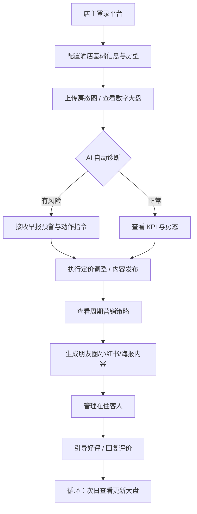

## 1. 产品概述

宿营家 AI 是面向酒店/民宿经营者的智能营销运营一体化平台。平台接入 PMS 房态数据，结合天气、节假日、入住率等多维因子，为数万家单体酒店与精品民宿提供智能定价、周期营销策略、内容生产、客服引导等一站式 AI 运营能力，解决"小体量住宿业态缺乏专业运营人才与工具"的核心痛点。

- 目标用户：单体酒店/精品民宿店主、前台运营人员
- 核心价值：将专业酒店运营经验 AI 化，降低运营门槛，提升出租率与客单价

## 2. 核心功能

### 2.1 用户角色
| 角色 | 注册方式 | 核心权限 |
|------|----------|----------|
| 店主/运营 | 平台分配 | 全部功能：配置、看盘、定价、内容发布、客服管理 |

### 2.2 功能模块
1. **酒店基础配置**：酒店信息、类型、城市、特色标签、客群定位、周边配套
2. **房型与定价管理**：房型增删改、基础房价、库存数量管理
3. **数字营销大盘**：KPI 指标卡片、AI 早报诊断、实时房态、近 7 日出租率图表、节假日备战进度、本周天气
4. **智能定价**：入住率 / 节假日 / 天气 / 竞争四因子定价模型，AI 推荐价格
5. **周期营销策略**：多阶段时间轴（蓄水期 → 冲刺期 → 服务期 → 后续期）
6. **内容发布**：朋友圈三档文案、小红书选题与标签、营销海报生成、视频口播文案、公众号推文、周边攻略
7. **前台客服**：好评引导与激励方案、AI 回评话术、在住客动态管理

### 2.3 页面详情
| 页面名称 | 模块名称 | 功能描述 |
|----------|----------|----------|
| 酒店基础信息 | 基础配置表单 | 填写酒店名称、类型、城市、房量、特色标签、客群定位、周边配套 |
| 房型与定价 | 房型列表 | 增删改房型名称/基础房价/数量，保存配置 |
| 数字营销大盘 | KPI 指标区 | 今日出租率、已售/总房量、预计营收、RevPAR，含环比变化 |
| 数字营销大盘 | AI 早报诊断 | 基于天气/房态/节假日的自动化运营诊断与指令 |
| 数字营销大盘 | 实时房态 | 按房型展示每间房状态（已售/空闲/待清洁/维修） |
| 数字营销大盘 | 近 7 日出租率 | 柱状图展示每日出租率趋势 |
| 数字营销大盘 | 节假日备战进度 | 预订率、内容发布、好评任务的进度条 |
| 数字营销大盘 | 本周天气 | 5 日天气预报卡片 + 天气驱动的营销建议 |
| 智能定价 | 影响因子选择器 | 入住率、节假日、天气、竞争四维选择 |
| 智能定价 | AI 价格建议 | 各房型推荐价格、调价幅度、定价理由 |
| 周期营销策略 | 策略时间轴 | 多阶段营销动作拆解与时间线 |
| 朋友圈文案 | 三档文案 | 早间种草 / 午间互动 / 晚间满房，支持复制 |
| 小红书营销 | 选题推荐 | AI 推荐选题 + 话题标签，支持选择 |
| 营销海报 | 海报模板 | 多风格海报预览选择，AI 生成方案 |
| 视频口播 | 口播文案 | 抖音短视频口播脚本，支持复制 |
| 公众号推文 | 生成来源 | 从视频/音频/节日活动转化为推文 |
| 周边攻略 | 天气触发攻略 | 根据天气自动推荐对应游玩攻略 |
| 好评引导 | 好评生成 | 按客群类型生成个性化好评模板 |
| 好评引导 | 激励方案 | 离店礼品、欢迎信、复购优惠码等方案选择 |
| 回评话术 | 话术模板 | 按评价类型/回复风格生成回评话术 |
| 在住客管理 | 客人动态列表 | 展示在住客人信息、来源渠道、离店时间、快捷操作 |

## 3. 核心流程

## 4. 用户界面设计

### 4.1 设计风格
- **主题定位**：东方禅意 × 现代简约 — 从莫干山竹林自然中提取灵感，营造宁静、雅致、可信赖的专业感
- **主色调**：深竹绿 `#1A3C2A`（品牌主色）、暖白 `#FAF8F5`（背景）、浅米 `#F5F0E8`（卡片底）、柔棕 `#8B7355`（次级文字）
- **强调色**：新绿 `#4A7C59`（正向指标）、琥珀 `#C4953A`（预警）、砖红 `#C46B5A`（负向指标）
- **按钮风格**：柔和圆角（8px），主按钮深绿实底白字，次级按钮描边透明底
- **字体**：标题用 `Noto Serif SC`（思源宋体），正文用 `Noto Sans SC`（思源黑体）
- **布局风格**：左侧固定侧边栏 + 右侧自适应内容区，卡片化信息组织，充足留白
- **图标风格**：使用 Lucide Icons，线性风格，2px 粗细

### 4.2 页面设计概览
| 页面名称 | 模块名称 | UI 元素描述 |
|----------|----------|------------|
| 全局 | 顶栏 | 品牌 Logo + 酒店名称 + 天气/日期芯片 + 上传房态图按钮 |
| 全局 | 侧边栏 | 分组导航：初始配置 / 店长看板 / 内容发布 / 前台客服，当前选中项左侧绿色指示条 + 浅绿背景 |
| 数字营销大盘 | KPI 指标区 | 4 列网格，每个 KPI 卡片含数值、标签、环比变化箭头 |
| 数字营销大盘 | AI 早报 | 多色预警卡片（琥珀/绿/紫/蓝），带左侧色条 |
| 数字营销大盘 | 实时房态 | 按房型分组的小色块矩阵，绿=已售、蓝=空闲、橙=待清、黄=维修 |
| 数字营销大盘 | 近 7 日出租率 | CSS 柱状图，今日列高亮 |
| 智能定价 | 影响因子 | 下拉选择器网格，生成按钮触发 |
| 智能定价 | 价格卡片 | 房型名 + 推荐价（大字绿）+ 基础价（划线）+ 涨跌幅百分比 |
| 周期策略 | 时间轴 | 左侧圆形节点 + 连接线 + 右侧文字内容 |
| 朋友圈文案 | 文案卡片 | 时段标签 + 文本域 + 复制按钮 |
| 营销海报 | 海报模板 | 3 列网格，选中边框高亮 |

### 4.3 响应式设计
- Desktop-first 设计，基准宽度 1440px
- 平板（<1024px）：侧边栏收起为图标模式，内容区 KPI 卡片由 4 列变为 2 列
- 手机（<768px）：侧边栏变为底部 Tab 导航，内容区单列堆叠，卡片全宽

## 5. 非功能性需求
- 首屏加载时间 < 2 秒
- 全平台纯前端实现，数据存储于 localStorage 模拟
- 所有交互提供即时视觉反馈（hover 态、点击态、加载态）
- 支持主流浏览器 Chrome / Edge / Safari 最新两个版本
