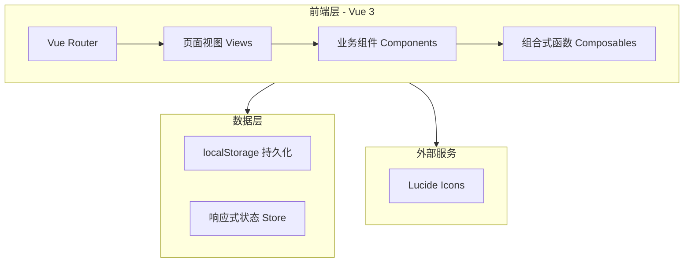

## 1. 架构设计



纯前端 SPA 架构，无后端服务。数据通过 Pinia 状态管理 + localStorage 持久化。

## 2. 技术栈

| 类别 | 技术选型 | 版本 |
|------|----------|------|
| 框架 | Vue 3 (Composition API) | ^3.4 |
| 语言 | TypeScript | ^5.3 |
| 构建工具 | Vite | ^5 |
| CSS | Tailwind CSS | ^3.4 |
| 路由 | Vue Router | ^4 |
| 状态管理 | Pinia | ^2 |
| 图标 | Lucide Vue Next | latest |
| 字体 | Noto Serif SC + Noto Sans SC | Google Fonts |

## 3. 路由定义

| 路由路径 | 视图组件 | 说明 |
|----------|----------|------|
| `/` | DashboardView | 默认重定向至数字营销大盘 |
| `/setup` | SetupView | 酒店基础信息配置 |
| `/rooms` | RoomsView | 房型与定价管理 |
| `/dashboard` | DashboardView | 数字营销大盘 |
| `/pricing` | PricingView | 智能定价 |
| `/strategy` | StrategyView | 周期营销策略 |
| `/wechat` | WechatView | 朋友圈文案 |
| `/xhs` | XhsView | 小红书营销 |
| `/poster` | PosterView | 营销海报 |
| `/video` | VideoView | 视频口播 |
| `/article` | ArticleView | 公众号推文 |
| `/guide` | GuideView | 周边攻略 |
| `/review` | ReviewView | 好评引导 |
| `/reply` | ReplyView | 回评话术 |
| `/checkin` | CheckinView | 在住客管理 |

## 4. 数据模型

### 4.1 酒店配置
```typescript
interface HotelConfig {
  name: string
  type: '精品民宿' | '度假酒店' | '商务酒店' | '亲子民宿'
  city: string
  totalRooms: number
  tags: string
  targetAudience: string
  nearby: string
}
```

### 4.2 房型
```typescript
interface RoomType {
  id: string
  name: string
  basePrice: number
  count: number
}

interface RoomStatus {
  roomTypeId: string
  rooms: { number: string; status: 'sold' | 'free' | 'dirty' | 'repair' }[]
}
```

### 4.3 定价因子
```typescript
interface PricingFactors {
  occupancy: string
  holiday: string
  weather: string
  competition: string
}

interface PriceRecommendation {
  roomTypeId: string
  recommendedPrice: number
  basePrice: number
  changePercent: number
}
```

## 5. 组件树

```
App.vue
├── AppLayout.vue
│   ├── TopBar.vue
│   │   ├── BrandLogo.vue
│   │   └── UploadButton.vue
│   ├── SideNav.vue
│   │   └── NavItem.vue
│   └── <router-view>
│       ├── SetupView.vue
│       ├── RoomsView.vue
│       │   └── RoomRow.vue
│       ├── DashboardView.vue
│       │   ├── KpiCard.vue
│       │   ├── AlertCard.vue
│       │   ├── RoomStatusGrid.vue
│       │   ├── BarChart.vue
│       │   └── ProgressBar.vue
│       ├── PricingView.vue
│       │   └── PriceCard.vue
│       ├── StrategyView.vue
│       │   └── TimelineItem.vue
│       ├── WechatView.vue
│       │   └── CopyTextArea.vue
│       ├── XhsView.vue
│       ├── PosterView.vue
│       ├── VideoView.vue
│       ├── ArticleView.vue
│       ├── GuideView.vue
│       ├── ReviewView.vue
│       ├── ReplyView.vue
│       ├── CheckinView.vue
│       │   └── GuestCard.vue
│       └── UploadModal.vue
```

## 6. 状态管理 (Pinia Store)

```typescript
// stores/hotel.ts
interface HotelState {
  config: HotelConfig
  roomTypes: RoomType[]
  roomStatuses: RoomStatus[]
  isConfigLoaded: boolean
}
```
