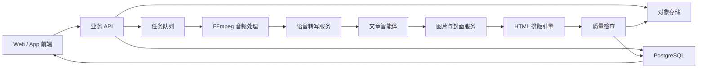

# 视频转公众号文章智能体：线上化技术方案

## 1. 项目背景

目前已经完成一个本地 Codex Skill：

```text
video-to-wechat-article
```

用户提供视频文件或逐字稿后，系统可以生成微信公众号发布所需的完整内容。

现有输出包括：

1. 原始带时间戳逐字稿
2. 原始纯文本逐字稿
3. 公众号文章 Markdown
4. 公众号预览 HTML
5. 公众号封面图
6. 至少 3 张正文配图

HTML 支持预览及“一键复制到公众号”。

目前该能力运行在本地 Codex 工作区，视频通过本地文件路径输入，使用 `faster-whisper` 完成语音转写。

现在需要将该能力线上化，并融合到另一个项目中，形成可通过前端和 API 调用的“视频内容智能生产子系统”。

---

## 2. 项目目标

建设一个在线视频转公众号文章智能体。

用户上传视频并选择文章风格后，系统自动完成：

```text
视频上传
→ 音频提取
→ 语音转写
→ 内容理解
→ 公众号文章重构
→ 正文配图
→ 封面生成
→ HTML 排版
→ 质量检查
→ 在线预览与下载
```

项目不是简单的视频转文字工具，而是一套面向公众号发布场景的 AI 内容生产服务。

---

## 3. 产品定位

建议产品名称：

- 视频转公众号智能体
- AI 公众号内容生产引擎
- 视频内容结构化发布系统

一句话定位：

> 基于语音识别、多模态 AI 和工作流编排技术，将视频自动转化为包含逐字稿、公众号文章、正文配图、封面和富文本排版的一站式发布素材。

---

## 4. 用户使用流程

### 4.1 创建任务

用户进入功能页面后：

1. 上传视频
2. 输入或确认文章标题
3. 选择排版样式
4. 选择配图风格
5. 选择文章长度
6. 点击“开始生成”

### 4.2 查看进度

前端显示任务阶段：

```text
上传中
音频处理中
语音转写中
文章生成中
配图生成中
排版生成中
质量检查中
已完成
```

### 4.3 编辑与发布

任务完成后，用户可以：

- 查看原始逐字稿
- 在线修改文章
- 切换排版预设
- 替换正文图片
- 重新生成封面
- 预览公众号效果
- 一键复制富文本
- 下载完整素材包

---

## 5. 核心功能

### 5.1 视频上传

- 支持 MP4、MOV、M4V 等常见格式
- 支持大文件和分片上传
- 校验文件格式、时长和大小
- 视频存入对象存储
- 数据库只保存文件 ID、URL 和元数据

### 5.2 音频提取

使用 FFmpeg：

- 从视频中提取音频
- 转换为语音识别适用的格式
- 可选降噪、单声道转换和采样率调整

### 5.3 语音转写

支持两种实现：

#### 方案 A：服务器部署 faster-whisper

优点：

- 不需要按次调用转写 API
- 数据可以保留在自有服务器
- 适合任务量稳定的场景

缺点：

- 需要 CPU/GPU 计算资源
- 要自行维护模型和并发

#### 方案 B：调用云端语音转写 API

优点：

- 接入简单
- 无需维护模型
- 容易弹性扩容

缺点：

- 产生按量费用
- 依赖第三方服务稳定性

转写模块需要输出：

```text
transcript_timestamped.txt
transcript_raw.txt
```

原始逐字稿不得进行内容润色。

### 5.4 内容理解与文章重构

文章智能体需要完成：

- 提取视频主题
- 判断目标读者
- 提炼主要观点
- 提取案例、步骤和数据
- 删除口水话和重复表达
- 修正文章中的明显转写错误
- 将口播结构改造成阅读结构
- 生成标题、导语、小标题和结尾

约束：

- 不虚构事实、人物、日期、数据或案例
- 不确定内容需要标记或避免过度断言
- 新闻、政策、价格和产品规格等信息需要联网核实

### 5.5 排版预设

首期支持：

```text
teal_tech       青绿渐变技术型
wechat_green    微信绿卡专业型
restrained_pro  克制专业型
checklist       选型清单型
oral_quote      口语金句型
```

排版预设应与文章内容分离。

同一篇文章可以切换不同模板，不需要重新生成正文。

### 5.6 正文配图

默认规则：

1. 优先使用真实照片场景图
2. 其次使用高质量手绘插画
3. 最后使用流程图或信息图
4. 避免满屏文字的卡片图

文章长度允许时，默认至少生成或匹配 3 张正文图片。

图片处理包括：

- 图片搜索或生成
- 内容安全检查
- 裁剪和压缩
- 上传对象存储
- 记录图片与文章章节的对应关系

### 5.7 公众号封面

推荐尺寸：

```text
900 × 383
```

封面包含：

- 文章主标题
- 简短副标题
- 分类标签
- 与排版预设一致的视觉系统

需要检查：

- 文字是否溢出
- 元素是否重叠
- 手机端是否清晰
- 图片是否与主题相关

### 5.8 HTML 排版和复制

系统将结构化文章数据渲染为：

- Markdown
- 公众号预览 HTML

HTML 要求：

- 不依赖外部 CSS
- 图片自适应宽度
- 支持移动端预览
- 顶部提供“复制到公众号”按钮
- 复制时只复制正文区域
- 同时写入 `text/html` 和 `text/plain`

需要注意：

微信公众号编辑器可能不接受 Base64 本地图片。

线上版应优先使用可公开访问或经过授权的对象存储图片 URL。

---

## 6. 推荐系统架构



### 推荐技术栈

```text
前端：Next.js / Vue 3
后端：FastAPI / NestJS
数据库：PostgreSQL
缓存与队列：Redis
Python 任务队列：Celery
Node.js 任务队列：BullMQ
文件存储：阿里云 OSS / 腾讯云 COS / AWS S3
视频处理：FFmpeg
本地转写：faster-whisper
AI 调用：OpenAI Responses API
智能体编排：OpenAI Agents SDK 或自定义状态机
部署：Docker + 云服务器 / Kubernetes
```

建议首期使用“确定性工作流 + 单个文章智能体”，不要一开始引入复杂多智能体。

---

## 7. 工作流设计

### 7.1 状态定义

```text
created
uploading
uploaded
extracting_audio
transcribing
generating_article
generating_images
rendering_html
quality_checking
completed
failed
cancelled
```

### 7.2 执行流程

```text
1. 创建任务
2. 上传视频
3. 提取音频
4. 生成带时间戳逐字稿
5. 生成纯文本逐字稿
6. 生成结构化文章 JSON
7. 生成或匹配正文配图
8. 生成封面
9. 渲染 Markdown
10. 渲染 HTML
11. 自动质量检查
12. 保存产物并通知前端
```

### 7.3 失败重试

每个阶段独立记录：

- 状态
- 开始时间
- 结束时间
- 重试次数
- 错误信息
- 输入和输出文件

建议策略：

- 网络类错误自动重试 2 至 3 次
- AI 格式错误重新请求一次
- 图片生成失败可降级为图库图片
- 单个配图失败不阻塞文章主体生成
- 转写失败需要终止后续文章生成

---

## 8. 文章结构化数据

不要让模型直接返回最终 HTML。

建议先返回结构化 JSON，再由模板引擎渲染。

示例：

```json
{
  "title": "我把视频转公众号文章，做成了一套 AI 工作流",
  "subtitle": "从转写、排版到一键复制",
  "summary": "文章摘要",
  "audience": "内容创作者和公众号运营",
  "sections": [
    {
      "id": "section_1",
      "heading": "为什么要做成 Skill",
      "paragraphs": [
        "正文段落一",
        "正文段落二"
      ],
      "highlights": [
        "关键结论"
      ],
      "list": [
        "步骤一",
        "步骤二"
      ],
      "image_prompt": "内容创作者在电脑前整理视频和文章的真实工作场景"
    }
  ],
  "ending": "结尾内容",
  "cover": {
    "title": "视频转公众号文章",
    "subtitle": "一套可复用的 AI 工作流",
    "category": "AI 工具"
  }
}
```

优点：

- 可以切换排版模板
- 可以局部重新生成
- 可以在线编辑
- 可以进行字段级质量检查
- 不需要让 AI 维护复杂 HTML

---

## 9. 数据库设计建议

### `media_files`

```text
id
user_id
original_name
storage_key
mime_type
size
duration
status
created_at
```

### `article_jobs`

```text
id
user_id
media_file_id
status
progress
style_preset
image_style
article_length
error_code
error_message
created_at
started_at
completed_at
```

### `transcripts`

```text
id
job_id
language
raw_text
timestamped_text
segments_json
model
created_at
```

### `articles`

```text
id
job_id
title
summary
content_json
raw_text
markdown
html
version
created_at
updated_at
```

### `article_assets`

```text
id
job_id
article_id
section_id
asset_type
storage_key
source
prompt
width
height
created_at
```

---

## 10. API 设计建议

### 10.1 获取上传地址

```http
POST /api/v1/uploads
```

请求：

```json
{
  "file_name": "demo.mp4",
  "mime_type": "video/mp4",
  "size": 104857600
}
```

响应：

```json
{
  "file_id": "file_123",
  "upload_url": "https://...",
  "expires_at": "2026-06-11T12:00:00Z"
}
```

### 10.2 创建生成任务

```http
POST /api/v1/article-jobs
```

请求：

```json
{
  "file_id": "file_123",
  "style_preset": "teal_tech",
  "image_style": "photo_first",
  "article_length": "medium",
  "language": "zh-CN"
}
```

响应：

```json
{
  "job_id": "job_456",
  "status": "created"
}
```

### 10.3 查询任务

```http
GET /api/v1/article-jobs/job_456
```

响应：

```json
{
  "job_id": "job_456",
  "status": "generating_article",
  "progress": 55,
  "current_step": "正在生成公众号文章"
}
```

### 10.4 获取结果

```http
GET /api/v1/article-jobs/job_456/result
```

响应：

```json
{
  "status": "completed",
  "transcript_timestamped_url": "https://...",
  "transcript_raw_url": "https://...",
  "markdown_url": "https://...",
  "preview_url": "https://...",
  "cover_url": "https://...",
  "assets": [
    {
      "section_id": "section_1",
      "url": "https://..."
    }
  ]
}
```

### 10.5 局部重新生成

```http
POST /api/v1/articles/{article_id}/regenerate
```

请求：

```json
{
  "target": "cover",
  "instruction": "减少文字，增加真实办公场景"
}
```

`target` 可以支持：

```text
title
summary
section
image
cover
full_article
```

---

## 11. 智能体与现有 Skill 的关系

现有 Skill 不需要原样部署到生产服务器。

应该拆成三部分：

### 11.1 Prompt 和内容规则

来源：

- `SKILL.md`
- `layout-styles.md`
- `output-package.md`
- `style-presets.md`

线上化后保存为：

- 系统提示词
- 版本化配置
- 数据库模板
- JSON Schema

### 11.2 确定性程序

由代码实现：

- 上传
- FFmpeg
- 转写
- 文件保存
- Markdown 渲染
- HTML 渲染
- 图片压缩
- 任务队列
- 状态管理

### 11.3 AI 智能判断

由模型完成：

- 文章结构重构
- 标题和摘要生成
- 识别重点内容
- 生成图片提示词
- 判断排版预设
- 内容质量检查

原则：

> 可以用代码确定完成的事情，不交给智能体自由判断。

---

## 12. 安全与合规

需要考虑：

- 视频文件访问权限
- 对象存储私有读写
- 临时签名 URL
- 用户数据隔离
- 文件定期清理
- 上传病毒和恶意文件检查
- AI 内容安全审核
- 图片版权和来源记录
- 用户删除任务和数据的能力
- 日志中不得记录完整视频内容或敏感信息

如果用户视频包含个人信息、商业机密或内部会议，需要在隐私政策中明确说明处理方式。

---

## 13. 性能和成本

主要成本来源：

1. 视频对象存储
2. 上传和下载流量
3. FFmpeg 计算
4. 语音转写
5. 大模型文章生成
6. 图片搜索或生成
7. CDN 流量

建议：

- 视频和中间音频设置生命周期自动删除
- 对逐字稿和文章结果长期保存
- 用小模型完成分类和格式检查
- 用主模型完成文章重构
- 图片按需生成，不要默认生成过多版本
- 转写服务与文章生成服务分别扩容

---

## 14. 分阶段实施

### 第一阶段：MVP

- 视频上传
- 异步任务
- faster-whisper 或云端转写
- 单一文章生成流程
- 两种排版预设
- Markdown 和 HTML
- 封面生成
- 在线预览与下载

### 第二阶段：可编辑产品

- 在线文章编辑器
- 切换排版预设
- 单章节重新生成
- 替换配图
- 重新生成封面
- 历史版本
- 任务失败重试

### 第三阶段：智能内容平台

- 多账号和团队协作
- 品牌样式库
- 用户自定义排版模板
- 批量视频处理
- 内容审核
- 发布平台集成
- 数据分析与内容复用

---

## 15. MVP 验收标准

- 支持上传 MP4 视频
- 任务创建后立即返回 `job_id`
- 前端能够查询进度
- 成功输出两份逐字稿
- 成功输出 Markdown
- 成功输出公众号预览 HTML
- 成功输出封面
- 正文至少包含 3 张相关图片
- 文章风格可以选择
- 任务失败有明确错误信息
- 同一个任务可以重新生成
- 产物可以在线预览和下载

---

## 16. 需要 Claude 协助的内容

请 Claude 基于本方案完成以下工作：

1. 评审整体架构是否合理
2. 根据目标项目现有技术栈调整方案
3. 设计后端目录结构和模块边界
4. 输出 PostgreSQL 数据库 Schema
5. 输出 API OpenAPI 规范
6. 设计任务状态机和失败重试机制
7. 设计文章结构化 JSON Schema
8. 明确 Responses API 或 Agents SDK 的接入方式
9. 给出 MVP 开发任务拆解和工作量预估
10. 标出技术风险、成本风险和安全风险

Claude 在开始设计前，需要先了解目标项目：

- 当前前端技术栈
- 当前后端技术栈
- 部署平台
- 用户系统
- 文件存储方式
- 是否已有 Redis 和任务队列
- 预计视频时长和并发量
- 是否允许使用第三方 AI API

---

## 17. 给 Claude 的指令

可以将下面这段与本文档一起发给 Claude：

```text
请阅读《视频转公众号文章智能体：线上化技术方案》。

我要把这个能力融合到现有项目中。请先分析方案，不要直接写代码。

请完成：
1. 根据现有项目代码识别技术栈和架构；
2. 说明该子系统应该放在哪些模块中；
3. 给出数据库、API、任务队列、文件存储和 AI 调用设计；
4. 将功能拆成 MVP 和后续迭代；
5. 给出需要新增或修改的文件清单；
6. 标出需要我确认的产品和技术决策；
7. 等我确认方案后再开始实现。

设计原则：
- 使用异步任务，不阻塞 HTTP 请求；
- AI 返回结构化 JSON，不直接生成最终 HTML；
- HTML 由模板引擎渲染；
- 视频、音频、图片存入对象存储；
- 所有任务可查询进度、失败原因并支持重试；
- 现有 video-to-wechat-article Skill 只作为规则和提示词来源；
- 代码实现应遵循目标项目已有技术栈和代码风格。
```

---

## 18. 官方参考

- [OpenAI Agents SDK](https://openai.github.io/openai-agents-python/)
- [OpenAI 音频与转写](https://developers.openai.com/api/docs/guides/audio)
- [OpenAI 后台任务](https://developers.openai.com/api/docs/guides/background)
- [OpenAI 工具调用](https://developers.openai.com/api/docs/guides/tools)
- [Codex Skills](https://developers.openai.com/codex/skills/)

